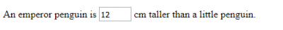

# Best practices for preparing XLIFF files

<!--- https://gist.github.com/rxaviers/7360908 -->

[comment]: <> (Your organization knows that you must prepare your content for translation in the XLIFF format. As your organization's lead engineer, you meet the technical requirements and know how to deal with the XML metalanguage to produce well-formed and valid, therefore interoperable XLIFF files that the linguists' translation editor can open.)

[comment]: <> (However, you might be preparing your organization's content in a way that makes translation and review more difficult than they should be, or even a nightmare, because you might not be aware of some localization and internationalization sensitive issues and might be working things around to comply with the XLIFF standard without applying best practices that do take into account the translator’s perspective.)

[comment]: <> (In cApStAn we like to intervene and advise from an early stage, sharing our translation and internationalization know-how, even before the source content is conceived and typeset, to make sure our partners' engineers craft good XLIFF files that our linguists will not struggle with.)

## Introduction

This report includes recommendations for preparing content for translation in the XLIFF format with a view to producing XLIFF files that optimize the different language tasks and language asset management both in the short and the long run. It also focuses on issues that can be problematic for language experts and how those issues can be avoided.

To illustrate the DO's and DON'T's, one OmegaT <span id="a1">[[1]](#1)</span> project is provided, containing:

  * the original files (XML, HTML, SVG, etc.), in folder `original`
  * the problematic prepared XLIFF files, in folder `source/01_haram`
  * the optimal prepared XLIFF files, in folder `source/02_halal`

This is the file structure in the project:

    xliff_bestpractices_omtprj (project)
        + original (source content)
            + 02_halal
                - entities.html
                - markup_custom_xml
                - markup_inline.svg
                - markup_input.html
                - markup_span.html
                - segment_para.html
        + source (prepared files for translation)
            + 01_haram (problematic)
                - entities.html.xlf
                - markup_custom_xml.xlf
                - markup_inline.svg.xlf
                - markup_input.html.xlf
                - markup_span.html.xlf
                - segment_para.html.xlf
            + 02_halal (recommended)
                - entities.html.xlf
                - markup_custom_xml.xlf
                - markup_inline.svg.xlf
                - markup_input.html.xlf
                - markup_span.html.xlf
                - segment_para.html.xlf

You can open the XLIFF files and look at them in an XML editor, but probably the best way to see the impact of the different preparation is to open the project in OmegaT and compare each _haram_ file with its corresponding _halal_ files. The project can be downloaded twice with different names and two instances of OmegaT can be run simultaneously for a handier comparison.

To open the project in OmegaT:

[comment]: <> (Download and install our custom version of OmegaT: http://cat.capstan.be/OmegaTcp_installer.exe)

  - Install and customize OmegaT as per our [installation and customization guide](https://slides.com/capstan/omegat-installation-and-customization-guide/fullscreen) <span id="a1">[[2]](#2)</span>
  - Go to     **Project** >     **Download team project** and enter the following details:
    - url: `http://svn.capstan.be/testproject1/xliff_bestpractices_omtprj`
	- credentials: `capstanview` (username) / `cApStAn2016` (password)
	- your preferred path to your local copy of the project.

That will create a local version of the project for you and will open it. You can click on the different files in the project files window to display the different content in the translation editor.

The Okapi project, including the settings files, can also be downloaded from [`http://cat.capstan.be/xliff_bestpractices_okpprj.zip`](http://cat.capstan.be/xliff_bestpractices_okpprj.zip), although this is not necessary unless you want to recreate or customize the extraction process. To (re)create the XLIFF files, the `rnb` file must be open from Okapi Rainbow.

In this document, segments as the linguist sees them in the translation editor are represented as follows (preceded by the segment number):

> <kbd>31</kbd> This is a segment

## Requirements

The only strict requirement is to create well-formed and valid XLIFF files, according to the XLIFF specification <span id="a3">[[3]](#3)</span>. Created XLIFF files can be validated with the strict XML schema <span id="a4">[[4]](#4)</span> or using the XLIFF Checker <span id="a5">[[5]](#5)</span>.

However, it is possible to produce XLIFF files that are compliant with the XLIFF standard as required but that are not translation-friendly. The main purpose of this report is to promote certain best practices, upon which the following recommendations are based.

## Recommendations

Based on the localization industry's best practices for preparing files for translation and on our experience in localization of questionnaires and cognitive assessments, we can define a number of important recommendations:

  * Text must be segmented by sentence. Each segment should contain one sentence, not a full paragraph.
  * All translatable content must be extracted and all untranslatable content must be ignored during the extraction.
  * Inline codes should not be taken as boundaries between text units/blocks, to avoid breaking down sentences into two or more fragments.
  * Inline codes and markup should be represented as specified by the XLIFF standard that the translation editor can recognize, lock and display as placeable tags.
  * The number of tags should be as low as possible.
  * If markup is not represented as tags and is escaped instead, then each markup block should be as short as possible.

Failure to follow those recommendations hampers language tasks or/and could affect translation quality.

There are other, less important recommendations with a lesser impact on their own. However, recurrent and concurrent failure to follow them can also contribute to making the translation process more difficult:

  * Unicode characters should be used instead escaped HTML entities.
  * Excessive whitespace and inline line breaks should be avoided.
  * To avoid truncations and overflowing text, text should be wrapped in the presentation medium instead of using linebreak codes in the source text.
  * Comments should be not extracted as translatable text.

### 1. Use segmentation

Translating or reviewing long paragraphs containing several sentences is inconvenient for several reasons.

On the one hand, it requires a higher cognitive effort from the linguist, which reduces productivity and increases the chances of errors, and on the other hand, it reduces the likelihood of propagation and internal reuse of translations within the project, which leads to rework, reducing turnaround time savings, and to a higher number of inconsistencies, that are difficult to catch afterwards.

Sentence-based segmentation boosts the reuse of translations, through the propagation of the translation of a repeated segment to all its repetitions, or through the higher availability of matches to translate similar segments, thus increasing consistency, and reduces the need for the linguist to run concordance searches in search of the different parts that need to be assembled in the final translation. Segmentation contributes both to final quality and satisfaction of the team.

Segmentation should occur after each sentence, so that each sentence is included in one segment and each segment contains only one sentence. For example, a paragraph typically contains several sentences, like the following:

> Lorem ipsum dolor sit amet, consectetur adipiscing elit… Aliquam ex nisi, mattis pulvinar nulla sed, commodo mattis ligula. Nulla sit amet leo lacinia, pellentesque mi non, aliquam augue? Pellentesque tempor dictum dui in imperdiet. Fusce ligula arcu, hendrerit eu dignissim eget, consequat quis sem! Maecenas eget ligula dapibus, dictum purus vitae, sodales neque.

If the text is segmented, this long paragraph can be handled as independent sentences and therefore becomes much more manageable for the linguist. The expected result is:

> <kbd>1</kbd> Lorem ipsum dolor sit amet, consectetur adipiscing elit…\
> <kbd>2</kbd> Aliquam ex nisi, mattis pulvinar nulla sed, commodo mattis ligula.\
> <kbd>3</kbd> Nulla sit amet leo lacinia, pellentesque mi non, aliquam augue?\
> <kbd>4</kbd> Pellentesque tempor dictum dui in imperdiet.\
> <kbd>5</kbd> Fusce ligula arcu, hendrerit eu dignissim eget, consequat quis sem!\
> <kbd>6</kbd> Maecenas eget ligula dapibus, dictum purus vitae, sodales neque.

To implement segmentation, you must use segmentation rules. Different tools might have slightly different implementations, but they all use regular expressions to match the patterns that correspond to sentence boundaries. SRX <span id="a6">[[6]](#1)</span> is an XML-based standard of the localization industry used to define segmentation rules, and it can be used by Okapi Framework <span id="a7">[[7]](#7)</span>. Segmentation rulesets can be easily created and customized in Okapi Ratel <span id="a8">[[8]](#8)</span>.

Libraries or tools used to prepare files as XLIFF normally include a basic set of default rules but sometimes it is necessary to create more specific rules to meet the specific needs of the source content. The XLIFF code to segment the paragraph above looks like this:


``` xml
<seg-source><mrk mid="0" mtype="seg">Lorem ipsum dolor sit amet, consectetur adipiscing
elit… </mrk> <mrk mid="1" mtype="seg">Aliquam ex nisi, mattis pulvinar nulla sed, commodo
mattis ligula.</mrk> <mrk mid="2" mtype="seg">Nulla sit amet leo lacinia, pellentesque mi
non, aliquam augue?</mrk> <mrk mid="3" mtype="seg">Pellentesque tempor dictum dui in
imperdiet. </mrk> <mrk mid="4" mtype="seg">Fusce ligula arcu, hendrerit eu dignissim eget,
consequat quis sem!</mrk> <mrk mid="5" mtype="seg">Maecenas eget ligula dapibus, dictum
purus vitae, sodales neque.</mrk></seg-source>
```

As you can see in the example above, segments do not only end in full stop, but might end in other punctuation marking the end of a sentence (i.e. in English: interrogation, ellipsis, etc.).

Also, there are cases where these punctuation symbols do not stand for the end of a sentence, such as in the case of abbreviations:

> <kbd>1</kbd>  NBC canceled Mr. Robinson, the freshman comedy series.

To avoid segmenting after abbreviations and in other cases, the segmentation ruleset must include some exceptions (the SRX default rulesets already include the most frequent abbreviations in English, so no need to reinvent the wheel). Without the appropriate exceptions for abbreviations, we would obtain the following incorrect segmentation:
rather than

> <kbd>1</kbd> NBC canceled Mr.\
> <kbd>2</kbd> Robinson, the freshman comedy series.

In the OmegaT project provided, file `01_haram/segment_para.html.xlf` shows a text that has been prepared without segmentation, whereas file `02_halal/segment_para.html.xlf` has been prepared with sentence-based segmentation.

### Representing markup as inline codes

The source content might include markup, e.g. any HTML tag used to apply a certain behavior or property to part of the text. Often source content is HTML or some sort of similar markup language, where therefore tags are used to define layout, formatting and/or structure. The preparation of the source files as XLIFF entails dealing with those codes as appropriate.

Codes can be of two kinds:

  * Suprasentential and intersentential codes (i.e. codes that embed a sentence, or stand outside of a sentence, or between sentences, or operate at a higher level than the sentence) should not be included in segments.
  * Intrasentential codes (i.e. codes that stand inside a sentence) must be represented as inline elements (also called "content markup") according to the guidelines of the XLIFF specification <span id="a9">[[9]](#9)</span>.

A leading opening tag appearing before the beginning of a sentence and its corresponding closing tag appearing after the end of the sentence are an example of suprasentential codes:

``` html
<p>What is the total length of the sticks in the line?</p>
```

They don't need to appear in the translation editor and the translator does not need to see them:

> <kbd>1</kbd> What is the total length of the sticks in the line?

On the other hand, the file `markup_span.html` from the sample project includes the following text:

``` xml
<p><span style="font-size:12pt;font-family:&quot;times new roman&quot;,&quot;serif
&quot;">Code1: </span><span style="font-size:12pt;font-family:&quot;times new roman
&quot;, &quot;serif&quot;">3/2 or 11/2 or 1.5</span></p>
```

which should be prepared as:

``` xml
<source xml:lang="en"><bpt id="1" ctype="x-span">&lt;span style='font-size:12pt;
font-family:"times new roman", "serif"'></bpt>Code1: <ept id="1">&lt;/span></ept>
<bpt id="2" ctype="x-span">&lt;span style='font-size:12pt;font-family:"times new
roman", "serif"'></bpt>3/2 or 11/2 or 1.5<ept id="2">&lt;/span></ept></source>
```

which will appear in the translation editor as:

> <kbd>1</kbd> `<g0>`Code1: `<g0><g1>`3/2 or 11/2 or 1.5`</g1>`


In OmegaT, if the translator needs to see what the inline code represents, hovering over the tag (e.g. `<g0>` below) displays the tag content as a tooltip, so the linguist knows what the markup means.

Representing the HTML tags as inline codes as specified in the XLIFF standard  also reduces the length of each tag, thus better legibility is obtained and the segments are much easier to handle.


> :warning: **_WARNING:_**  Escaping the HTML or XML tags by replacing `<` and `>` with `&lt;` and `&gt;` respectively is not a good approach, because the translation editor will consider the escaped markup as editable text rather than as locked codes and therefore the tags can be mishandled, let alone the fact that translation memories will be polluted. Furthermore, that approach does not reduce the length of inline codes, which means that the text is less readable and that can hamper the translation and bring about quality issues.


For example, if handled in that way, the above segment would look like this in the XLIFF file:

``` xml
<source xml:lang="en">&lt;span style=&quot;font-size:12pt;font-family:&amp;quot;
times new roman&amp;quot;, &amp;quot;serif&amp;quot;&quot;>Code1: &lt;/span&gt;
&lt;span style=&quot;font-size:12pt;font-family:&amp;quot;times new roman&amp;
quot;, &amp;quot;serif&amp;quot;&quot;>3/2 or 11/2 or 1.5&lt;/span&gt;</source>
```

and will be displayed like this to the linguist in the translation editor:

> `<span style="font-size:12pt;font-family:&quot;times new roman&quot;,  &quot;serif&quot;">`Code1: `</span><span style="font-size:12pt;font-family:&quot;times new roman&quot;, &quot;serif&quot;">`3/2 or 11/2 or 1.5`</span>`

In the OmegaT project provided, files `markup_custom_xml.xlf` and `markup_span.html.xlf` show what the text looks like when the inline codes have been simply escaped (the ones in the `01_haram` folder) and when they have been properly encapsulated as XLIFF markup (the ones in folder `02_halal`). There are two files to exemplify both standard HTML tags (e.g. `<span>`) as well as custom-crafted, even awkward XML tags.

### Encoding entities

HTML source content might contain named character references (in the form of `&char;`) but these named entities are not allowed in XML and therefore cannot be used in an XLIFF file as such unless they are declared (except for `&`, `<` and `>`). There is more than one possibility to prepare source HTML content containing named entities, and some ways are preferable to others. Let us consider the `&divide;` entity as an example, found in the HTML content:

``` xml
<p>(40 &divide; 10) + (8 &divide; 2)</p>
```

One possibility to create a valid XLIFF file is to escape the entities, as follows:

``` xml
<source>(40 &amp;divide; 10) + (8 &amp;divide; 2)</source>
```

The escaping approach is not recommended, though. Escapes were used to represent (by means of ASCII text only) characters that were not available in the character encoding you are using. The W3C (group in charge of the HTML specification) advises to use an encoding that allows to represent characters in their normal form, rather than using escaped character entity references, because using escapes can make it difficult to read and maintain source code, and can also significantly increase file size.<span id="a10">[[10]](#10)</span> Therefore, nowadays you should use UTF-8 for the character encoding of any modern internationalized content, which removes the need to use character escapes for that reason.

Also, this way the named entity rather than the actual character itself will be displayed in the translation editor, as shown below (which reduces readability and could be misleading or even unintelligible for the linguist):

> <kbd>1</kbd> 40 [&divide; 10) + (8 &divide; 2)

Linguists need to see the character, not the code. While `&divide;` (÷) or `&pi;` (π) might be more or less transparent in the appropriate context, other entities such as `&le;` (≤) or `&zwnj;` (zero-width non-joiner) will be obscure and puzzling. The linguist could think that the named entity must be maintained and therefore necessarily be used in the translation, whereas it might be the case that the target language spelling rules call for another character in that context. For example, this would be an incorrect translation according to French punctuation rules:

> <kbd>source</kbd> Punctuation works `&quot;`differently`&quot;` in French.\
> <kbd>target</kbd> La ponctuation est `&quot;`différente`&quot;` en français. :x:

Compare with the correct translation:

> <kbd>source</kbd> Punctuation works `&quot;`differently`&quot;` in French.\
> <kbd>target</kbd> La ponctuation est « différente » en français. :heavy_check_mark:

Escapes can be a way of avoiding the use of a character for other reasons (e.g. if they conflict with other elements), in which case, you might want to escape some entities specifically. Escapes might also be useful to represent invisible or ambiguous characters, or characters that would otherwise be difficult to handle, such as whitespace or invisible Unicode control characters (e.g. using `&rlm;` in HTML source content --and `&#x200F;` in the prepared XLIFF file-- helps spot these characters).[11] However, in all other cases, it is preferable to avoid the escape.

A different approach is to represent the same character by means of the universal Unicode code point expressed as a numeric entity (e.g. the hexadecimal entity `&#x00F7;`) or as the Unicode character itself (e.g. `÷`), the latter being slightly preferable because it simplifies maintenance and running text searches directly in the XLIFF files with, say, grep or any other text-based tool.

A simple pre-processing of the source content is possible to convert the HTML named entities into Unicode code points or Unicode characters. Even better, the ideal scenario would be to configure the authoring tool where the source content is authored so that such non-ASCII or special characters are represented using the Unicode character or numeric entities -- in which case no pre-processing conversion is necessary.  How authors insert symbols or special characters that are not on their keyboard depends on their authoring tool and their platform, but normally they can either pick the character from a special character palette (e.g. the Character Map in Windows or Character Viewer in Mac) or insert it by using a key combination, e.g. <kbd>ALT+0176</kbd> on the keypad to insert the degree symbol (i.e. `°`).[12]

Both the approaches in the previous paragraph will produce one of the two following XLIFF codes (depending on the encoding chosen):

``` xml
<source>(40 &#x00F7; 10) + (8 &#x00F7; 2)</source>
```

``` xml
<source>(40 ÷ 10) + (8 ÷ 2)</source>
```

which will be displayed as the following in the translation editor:

> <kbd>1</kbd> (40 ÷ 10) + (8 ÷ 2)

In a nutshell, then: using the Unicode characters in their normal form is preferable to representing them with their numeric --preferably hexadecimal-- reference, and any of those two options is preferable to escaping the named character references with `&amp;`, or declaring them in the preamble of the document.

| Approach  | Example   | Well-formed |  Recommended |
| --------- | --------- | ----------- | ------------ |
| Unicode character	 | `÷`  | yes | yes (more preferable) |
| numeric (hex) character reference   | `&#x00F7;`	| yes  | yes (less preferable) |
| unescaped named character reference | `&divide;`	| no (unless declared) | no (but feasible if declared in the document) |
| escaped named character reference   | `&amp;divide;`	| yes  | no  |

When preparing XLIFF files with Okapi Rainbow, both named entities and numeric entities in the source content will be encoded as the Unicode character in the XLIFF file. In the OmegaT project provided, you can see how the three possible inputs (in file `original/entities.html`) are encoded in the same way (as the Unicode character) using the recommended approach in file `02_halal/entities.html.xlf` and in the same unrecommended way in file `01_haram/entities.html.xlf`.

Some Unicode characters should be avoided in a markup context, and their numeric entity should be used instead [13]. Other than those, in a UTF-8 context (e.g. any content to be localized) there should be no reason why Unicode characters cannot be used.

## Frequent issues

Following the recommendations above is necessary but might not be enough for an optimized process. The source content might present a number of pitfalls that require special attention when creating the XLIFF files. Let us see some of those frequent issues that hamper the language tasks.

### Split sentences

Sometimes sentences might be broken in two or more parts because the extraction filter is treating an embedded code as the end of the paragraph. In the OmegaT project provided, file `01_haram/markup_input.html.xlf` shows how the sentence is broken at the text input code:

``` xml
<source>An emperor penguin is</source>
<source>cm taller than a little penguin.</source>
```

displayed in the translation editor as:

> <kbd>1</kbd> An emperor penguin is\
> <kbd>2</kbd> cm taller than a little penguin.

The original content (in file `original/markup_input.html`) looks like this:

``` xml
<p>An emperor penguin is <input type="text" name="fname" autocomplete="off"
size="4" id="emperor-penguin-versus-little-penguin" class="heigh-differnet"
pattern="[title="How many centimeters." formmethod="post" required autofocus>
cm taller than a little penguin.</p>
```

That code represents this display in the online questionnaire:




Here, the expected preparation is to represent the text input field markup as inline codes, as follows (and can be seen in `02_halal/markup_input.html.xlf`):

``` xml
<source xml:lang="en">An emperor penguin is <ph id="1" ctype="x-input">&lt;input
type="text" name="fname" autocomplete="off" size="4" id="emperor-penguin-versus-
little-penguin" class="heigh-differnet" pattern="[0-9](0-9]+")+"
[formmethod="post" required autofocus></ph> cm taller than a little penguin.
</source>
```

which will appear as follows in the translation editor (see file ????)

> <kbd>1</kbd> An emperor penguin is `<x0/>` cm taller than a little penguin. :heavy_check_mark:

File `markup_inline.svg.xlf` shows a similar case of text broken down at the two embedding SVG tags `<tspan>` and `</tspan>`.

Other similar examples:

> <kbd>1</kbd> Click :x:\
> <kbd>2</kbd> to move on.

> <kbd>1</kbd> See uses on :x:\
> <kbd>2</kbd> to show 2 children in her pictograph\
> <kbd>3</kbd> How many :x:\
> <kbd>4</kbd> will they need to draw?

> <kbd>1</kbd> Feed 5 penguins for :x:\
> <kbd>2</kbd> zeds.

> <kbd>1</kbd> Drag :x:\
> <kbd>2</kbd> onto the graph.

> <kbd>1</kbd> When your drawing is done, click :x:\
> <kbd>2</kbd> to fill the garden with boxes of flowers.

In all these cases the original content includes some element (e.g. "Click `[X](BUTTON)` to move on." or "Feed 5 penguins for `[QUANTITY]` zeds.") that has been interpreted as the end of a paragraph.

Apart from the inconvenience that the full sentence will not be stored in the translation memory as one unit, this is a further problem if the target language expresses things in a different order than English, e.g. say, "Tó móvê ón klïck `[X]`)". In that case the linguist is forced to break the expected one-to-one segment correspondence, in order to maintain the correct order.

Maintaining the correspondence will produce the wrong order in the final content according to the syntax of the target language:

> <kbd>1</kbd> klïck :x:\
> <kbd>2</kbd> Tó móvê ón :x:

Breaking the natural correspondence will produce the right order in the final content but makes reuse of these materials problematic when translating subsequent cycle's content using the TM containing these translations:

> <kbd>1</kbd> <kbd>source</kbd>  Click\
>      <kbd>target</kbd>  Tó móvê ón :x:\
> <kbd>2</kbd> <kbd>source</kbd>  to move on\
>      <kbd>target</kbd>   klïk. :x:

or

> <kbd>1</kbd> <kbd>source</kbd>  Click\
>      <kbd>target</kbd>  Tó móvê ón klïk :x:\
> <kbd>2</kbd> <kbd>source</kbd>  to move on\
>      <kbd>target</kbd>   


Auto-propagation can also become problematic, if the translation of a repeated segment (corresponding to part of the sentence) is different in different contexts, for example due to agreement with other parts of the sentence, e.g.

> <kbd>1</kbd> Front :x:\
> <kbd>2</kbd> wheel\
> <kbd>3</kbd> Front :x:\
> <kbd>4</kbd> headlamp

For example, in Spanish adjectives need to agree in gender and number with the nouns they modify, e.g. the translation of "front" is "delantera" (feminine) in seg1 to agree with the Spanish equivalent of "wheel" (i.e. "rueda"), which has feminine grammatical gender, whereas it is "delantero" (masculine) in seg3 to agree with the Spanish equivalent of "headlamp" (i.e. "faro"), which has masculine grammatical gender.

In these cases, to achieve the correct translation the linguist might need to disable the default auto-propagation (to prevent the translation of seg1 being pulled automatically into seg3), but that manual step could fail or be easily overlooked.

In a nutshell, split sentences can be a nuisance to translate into certain languages with different word order than English -- the linguist might have to work around the translation in difficult or impossible ways. Also, productivity and internal consistency can be compromised if the same text appears later in the same project, or in future cycles, with different or correct segmentation.

In the second example above, “she uses one” _something_ and the respondent is being asked “how many” _of something_ the person will need… The object referred to is missing, so it seems that the entity referring to that object was taken as the end of that structural unit.

**Expected preparation**:

The expected result in the cases above would have been to use a tag or a placeholder to encode the inline code:

> <kbd>1</kbd> See uses on %s to show 2 children in her pictograph :heavy_check_mark: \
> <kbd>2</kbd> How many %s will they need to draw? :heavy_check_mark:

> <kbd>1</kbd> Click `<BUTTON/>` to move on. :heavy_check_mark:

> <kbd>1</kbd> Front wheel :heavy_check_mark: \
> <kbd>2</kbd> Front headlamp :heavy_check_mark:

In the examples above where the segment has been properly prepared with inline codes, it’s not a problem for the translator to transfer the codes to the place where they belongs in the translation, as any modern translation editor allows to do that easily with a keyboard shortcut.

**Solution**:

To avoid this issue, then, ask a trained linguist to run a source review on your draft XLIFF files and adjust the extraction filter accordingly, so that it knows that that particular code must be treated as an inline code (extracted along with the surrounding text and protected) and not as the end of a paragraph.

### Markup nimiety

Segments overloaded with markup make translation and all related subsequent language tasks more difficult, therefore increasing the chance to introduce errors in the translation, especially in right-to-left languages such as Arabic.

Some inline codes are unavoidable, e.g. to provide style:

``` xml
Put the lengths in order from <b>shortest</b> to <i>longest</i>. ✅
```

However, other tags are unnecessary and should be avoided. For example, closing and opening tags of the same kind in the middle of a sentence or even in the middle of a word:

``` xml
Vehicl</strong><strong>es in 2000  ❌
```

When this happens repeatedly, it results in segments that are (unnecessarily) very translation unfriendly. For example:

``` xml
<strong>Star</strong><strong>t </strong><strong>T</strong><strong>i</strong><strong>me
</strong>  ❌
```

In that example, there are a lot of `<strong>` tags there to do the same job that could be achieved with simply one tag pair. This tag multiplicity might arise from adding superfluous formatting in a word processor or a wysiwyg editor to create the source, or from converting with OCR or from PDF.

**Expected preparation**:

The expected design of the source content in the case above would have been to embed the formatted text with one tag pair.

``` xml
<strong>Start Time</strong> ✅
```

This tag pair is actually suprasentential markup, which could be excluded from the prepared segment, thus producing the following simple display in the translation editor:

> <kbd>1</kbd> Start Time :heavy_check_mark:

**Solution**:

Provide feedback and tips to item developers and run some tag clean-up before extracting the text that must be included in the XLIFF files (tools like TransTools Document Cleaner can be used for that) <span id="14">[[14]](#1)</span>.

The solution of this issue does not affect how the source content is prepared, but instead it relates to the pre-processing of the source content, before it is prepared. The actually preparation (parsing, extraction and segmentation) is the same regardless of whether the issue is present in the source files.


### Ending segments at linebreaks

In some cases, linebreaks are used to limit the length of each line in the text. When the text is HTML, the text might be broken down at linebreak tags.

For example:
> <kbd>1</kbd> Since the 1970s, scientists have been\
> <kbd>2</kbd> `<br/>` :x:\
> <kbd>3</kbd> worried about the amount of Dioxin, a\
> <kbd>4</kbd> `<br/>`:x:\
> <kbd>5</kbd> toxin in fish caught in Baltic Sea.

The expected segmentation is the following, where the line break HTML tags are interpreted and represented as inline codes:

> `1` Since the 1970s, scientists have been `<br/>` worried about the amount of Dioxin, a toxin in fish caught in Baltic Sea. :heavy_check_mark:

However, it should not be assumed that the translator will keep the line break tags in the translation or that their location will be equivalent to the source.

**Solution**:

To avoid this issue, ask a linguist to run a source review on your draft XLIFF files and adjust the extraction filter accordingly, so that it treats the linebreak element as markup (extracted along with the surrounding text and protected) and not as the end of the paragraph.

However, if the purpose of the line break tags is indeed to wrap the text at a certain width, there might be more convenient ways to achieve that, without tags, such as CSS styles for HTML content. In general it is recommended to separate content from layout.

Therefore, our recommendation, in the first place, would be to avoid using line break tags in the source text. Secondly (assuming we are dealing with HTML content), the width of the text can be defined by means of CSS styles. That approach  achieves the same exact results without introducing any noise in the source text and without affecting the work of the translator. See https://jsfiddle.net/msoutopico/3p7x8ryr/1/ or the screenshot below:

<!---  -->


[comment]: <> (/** more issues. mixture of encodings **/)


## Annexes

Preparing XLIFF files for translation in OmegaT entails some additional tweaks due to the special characteristics of this CAT tool.

### Guidelines for creating XLIFF 1.2 files for OmegaT

#### Check list for translation

* The `target` element must exist and be populated with the source text.

For example:

```xml
  <trans-unit id="1086880">
    <source>This is the source text.</source>
    <target>This is the source text.</target>
  </trans-unit>
```

???? ADD TEMPLATE HERE

#### Check list for bilingual review

* The `trans-unit` must have attribute `xml:space` with value `preserve` if leading and trailing space included in the source text must be replicated in the translation.
* The `trans-unit` must have attribute-value pair `approved="yes"`.

For example:

```xml
  <trans-unit id="1086880" xml:space="preserve" approved="yes">
    <source>This is the source text.</source>
    <target>Esto es la traducción.</target>
  </trans-unit>
```

???? ADD TEMPLATE HERE

## References

1. <span id="1"></span> OmegaT is a free and open source computer-assisted translation tool (CAT-tool) that cApStAn uses to translate and review/edit XLIFF files in international large-scale translation projects. It offers more technical possibilities than OLT. [⏎](#a1)

2. <span id="2"></span> OmegaT installation and customization guide: https://slides.com/capstan/omegat-installation-and-customization-guide/fullscreen [⏎](#a2)

3. <span id="3"></span> See [http://docs.oasis-open.org/xliff/xliff-core/xliff-core.html](http://docs.oasis-open.org/xliff/xliff-core/xliff-core.html) [⏎](#a3)

4. <span id="4"></span> XML schema: [https://docs.oasis-open.org/xliff/v1.2/os/xliff-core-1.2-strict.xsd](https://docs.oasis-open.org/xliff/v1.2/os/xliff-core-1.2-strict.xsd) [⏎](#a4)

5. <span id="5"></span> The XLIFF checker can be downloaded from https://www.maxprograms.com/products/xliffchecker.html [⏎](#a5)

6. <span id="6"></span> See https://okapiframework.org/wiki/index.php?title=SRX. [⏎](#a6)

7. <span id="7"></span> Okapi Framework is a set of libraries that can be used to prepare files for translation, among other things. [⏎](#a7)

8. <span id="8"></span> See http://okapiframework.org/wiki/index.php?title=Ratel [⏎](#a8)

9. <span id="9"></span> See http://docs.oasis-open.org/xliff/v1.2/os/xliff-core.html#Struct_InLine and http://docs.oasis-open.org/xliff/v1.2/xliff-profile-html/xliff-profile-html-1.2-cd02.html. [⏎](#a9)

10. <span id="10"></span> See https://www.w3.org/International/questions/qa-escapes#not [⏎](#a10)

11. <span id="11"></span> See https://www.w3.org/International/questions/qa-escapes [⏎](#a11)

12. <span id="12"></span> See https://support.office.com/en-us/article/insert-ascii-or-unicode-latin-based-symbols-and-characters-d13f58d3-7bcb-44a7-a4d5-972ee12e50e0 and https://support.apple.com/en-us/HT201586 for Mac. [⏎](#a12)

13. <span id="13"></span> See https://www.w3.org/International/questions/qa-chars-vs-markup#not [⏎](#a13)

14. <span id="14"></span> See http://kb.memoq.com/article/AA-00485/0/Cleaning-unnecessary-tags-with-TransTools-Document-Cleaner.html [⏎](#a14)
